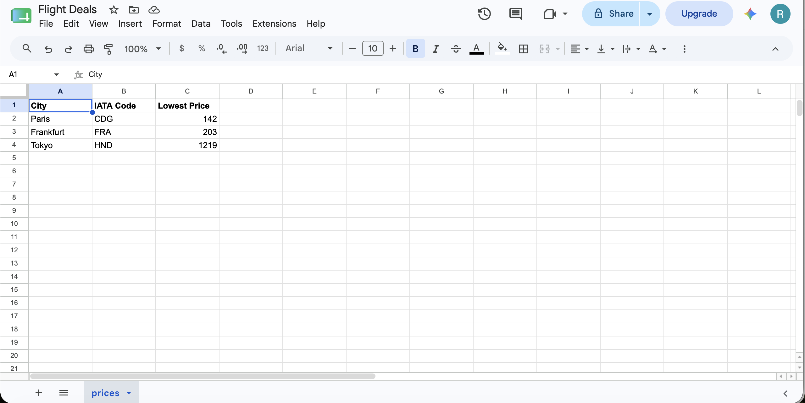
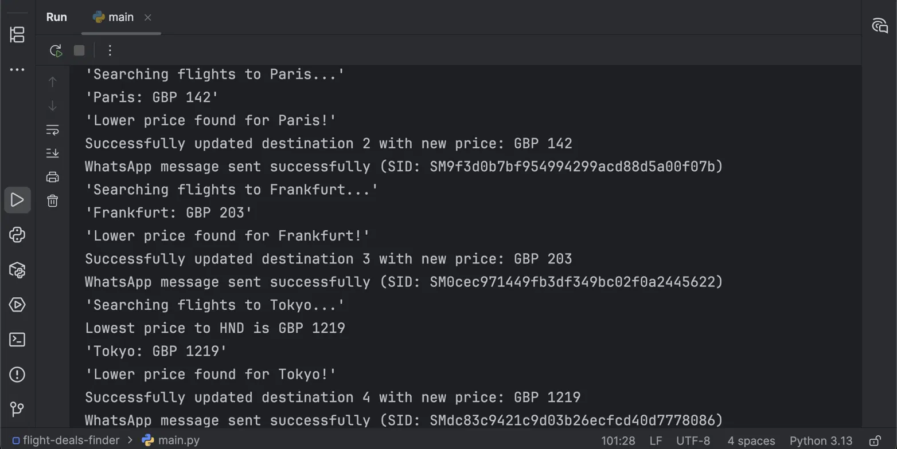
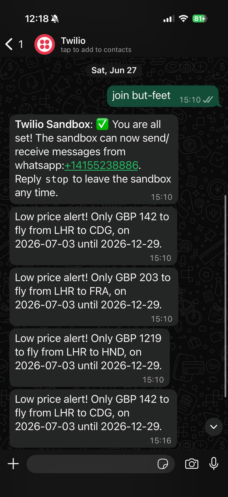

# Flight Deals Finder ✈️

An automated flight price monitoring application that searches for cheap flights, compares prices against a Google Sheet database, and sends notifications when better deals are found.

## Features

-  **Automated Flight Search** — Searches for flights across multiple destinations using SerpAPI
-  **Google Sheets Integration** — Stores and updates destination data via Sheety API
-  **Price Comparison** — Automatically identifies flights cheaper than recorded prices
-  **Real-time Notifications** — Sends WhatsApp or SMS alerts when deals are found
-  **Request Caching** — Caches API responses to preserve free tier limits and reduce costs
-  **Multi-destination Support** — Monitor prices for multiple cities simultaneously

## Tech Stack

- **Python 3.8+** — Core application language
- **SerpAPI** — Flight search data
- **Sheety** — Google Sheets API integration
- **Twilio** — SMS and WhatsApp notifications
- **requests-cache** — API response caching

## How It Works

1. **Retrieve Destinations** — Fetches destination list from Google Sheet
2. **Search Flights** — Queries SerpAPI for available flights within the next 6 months
3. **Find Cheapest** — Identifies the lowest price for each destination
4. **Compare Prices** — Checks if the new price is lower than the recorded lowest price
5. **Update Sheet** — Updates the Google Sheet with the new price if cheaper
6. **Notify User** — Sends WhatsApp or SMS notification about the deal

## Demo

## Screenshots

### Google Sheets



### Terminal Output



### WhatsApp Notifications


## Installation

### Prerequisites

- Python 3.8 or higher
- Git
- Free accounts for:
  - [SerpAPI](https://serpapi.com/) (for flight data)
  - [Sheety](https://sheety.co/) (for Google Sheets API)
  - [Twilio](https://www.twilio.com/) (for notifications)

### Clone the Repository

```bash
git clone https://github.com/yourusername/flight-deals-finder.git
cd flight-deals-finder
```

### Install Dependencies

```bash
pip install -r requirements.txt
```

## Architecture

```
┌─────────────┐
│ Google      │
│ Sheets      │
└──────┬──────┘
       │
       ▼
┌─────────────────────┐
│ DataManager         │
│ (Sheety API)        │
└──────┬──────────────┘
       │
       ▼
┌─────────────────────┐
│ FlightSearch        │
│ (SerpAPI)           │
└──────┬──────────────┘
       │
       ▼
┌─────────────────────┐
│ find_cheapest_flight│
│ (Flight Data)       │
└──────┬──────────────┘
       │
       ▼
┌─────────────────────┐
│ NotificationManager │
│ (Twilio API)        │
└──────┬──────────────┘
       │
       ▼
┌─────────────────────┐
│ WhatsApp / SMS      │
│ Notifications       │
└─────────────────────┘
```

## Configuration

### 1. Create a `.env` File

Create a `.env` file in the project root and copy from `.env.example`:

```bash
cp .env.example .env
```

Then fill in your actual credentials:

```env
# SerpAPI (Flight Search)
SERPAPI_API_KEY=your_serpapi_key_here

# Sheety (Google Sheets)
SHEETY_USERNAME=your_sheety_username
SHEETY_PASSWORD=your_sheety_password

# Twilio (Notifications)
TWILIO_SID=your_twilio_sid
TWILIO_AUTH_TOKEN=your_twilio_auth_token
TWILIO_VIRTUAL_NUMBER=+1234567890
TWILIO_VERIFIED_NUMBER=+your_phone_number
TWILIO_WHATSAPP_NUMBER=+14155238886
```

### 2. Set Up Google Sheet

1. Create a Google Sheet with the following columns:
   - `city` — Destination city name
   - `iataCode` — Airport IATA code
   - `lowestPrice` — Current lowest recorded price

2. Use [Sheety](https://sheety.co/) to create an API for your sheet

3. Copy the endpoint URL to your `.env` file

### 3. Configure Twilio

#### For WhatsApp Notifications:

1. Go to [Twilio Console](https://console.twilio.com/)
2. Navigate to **Messaging → WhatsApp → Sandbox**
3. Join the sandbox by sending the join code to the Twilio WhatsApp number
4. Update your `.env` with the sandbox details

#### For SMS Notifications:

1. Purchase or use your trial Twilio number
2. Verify your personal phone number in Twilio
3. Update your `.env` with the SMS details

## Usage

### Run the Application

```bash
python main.py
```

The script will:
1. Fetch all destinations from your Google Sheet
2. Search for flights for each destination
3. Update prices if cheaper flights are found
4. Send notifications for any deals discovered

### Change Notification Method

To use SMS instead of WhatsApp, edit `main.py`:

```python
# Current (WhatsApp):
notification_manager.send_whatsapp(message)

# Switch to SMS:
notification_manager.send_sms(message)
```

### Schedule Automated Runs

To run the script automatically at regular intervals:

**On macOS/Linux (using cron):**

```bash
crontab -e
```

Add this line to run daily at 8 AM:

```
0 8 * * * /usr/bin/python3 /path/to/flight-deals-finder/main.py
```

**On Windows (using Task Scheduler):**

1. Open Task Scheduler
2. Create a new task
3. Set the trigger (daily, weekly, etc.)
4. Set the action to run `python main.py`

## Project Structure

```
flight-deals-finder/
├── main.py                    # Main application entry point
├── flight_search.py          # SerpAPI flight search integration
├── data_manager.py           # Google Sheets (Sheety) integration
├── notification_manager.py   # Twilio notification service
├── flight_data.py            # Flight data model and processing
├── requirements.txt          # Python dependencies
├── .env.example              # Example environment variables
├── .gitignore               # Git ignore rules
└── flight_cache.sqlite      # Cached API responses (auto-generated)
```

## Technologies Used

- **Python 3.8+** — Core language
- **SerpAPI** — Flight search API
- **Sheety** — Google Sheets API
- **Twilio** — SMS and WhatsApp notifications
- **requests-cache** — Request caching and optimization

## Troubleshooting

### No Messages Received

**WhatsApp Sandbox:**
- Ensure you've joined the sandbox (sent the join code)
- Check that `TWILIO_VERIFIED_NUMBER` matches your WhatsApp number

**SMS:**
- Verify your phone number in Twilio console
- Check that your number is in the correct format with country code

### API Errors

- Verify all API keys and credentials in `.env`
- Check that your SerpAPI and Sheety free tier limits haven't been exceeded
- Ensure your internet connection is stable

### Flights Not Found

- Check that IATA codes are correct
- Verify that flights exist for the date range
- Check SerpAPI console for any rate limiting messages

## Future Improvements

-  Email notifications as alternative to WhatsApp/SMS
-  Support for multiple departure airports
-  Web dashboard for price tracking
-  Cloud deployment (AWS Lambda, Heroku)
-  Detailed logging and history tracking
-  Docker containerization
-  Enhanced error handling and retry logic
-  Mobile app integration

## License

This project is open source and available under the MIT License.

## Disclaimer

This project is for educational purposes. Ensure you comply with the terms of service for all APIs used (SerpAPI, Sheety, Twilio).

---

**Happy finding cheap flights! ✈️**
